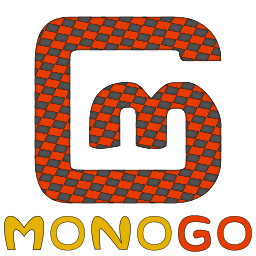
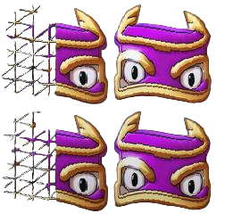
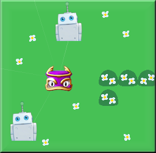

<section class="container-xxl my-5">
		<h4 id="monogo-documentation" class="fw-bold"><a href="#monogo-documentation">MonoGo Engine Documentation</a></h4>
		
Cross-Platform .NET 8 C# 2D game engine build ontop of MonoGame.

</section>
<section class="container-xxl mb-5">

	

		

			<a target="_self" href="{{_hostname}}/api/index.html" class="mg-no-link">
				

					

					
					

					

					
<i class="bi bi-filetype-cs"></i> API Reference

					
View the API reference for each class and method in the MonoGo Engine.

					
Click to view the <b>API Reference</b>

				

			</a>
		

    

	

		

			<a target="_self" href="https://github.com/MonoGo-Engine/MonoGo.Samples" class="mg-no-link">
				

					

						
					

					

					
<i class="bi bi-github"></i> Samples Project

					
View the sample project which demonstrates all the features of the MonoGo Engine.

					
Click to go to the <b>Samples Repository</b>

				

			

        </a>
    

	

		

			<a target="_self" href="" class="mg-no-link">
				

					

						
					

					

					
<i class="bi bi-github"></i> Demo Game

					
A full demo game made with the MonoGo Engine.

					
<b>---Coming Soon™---</b>

				

			

        </a>
    

</section>
